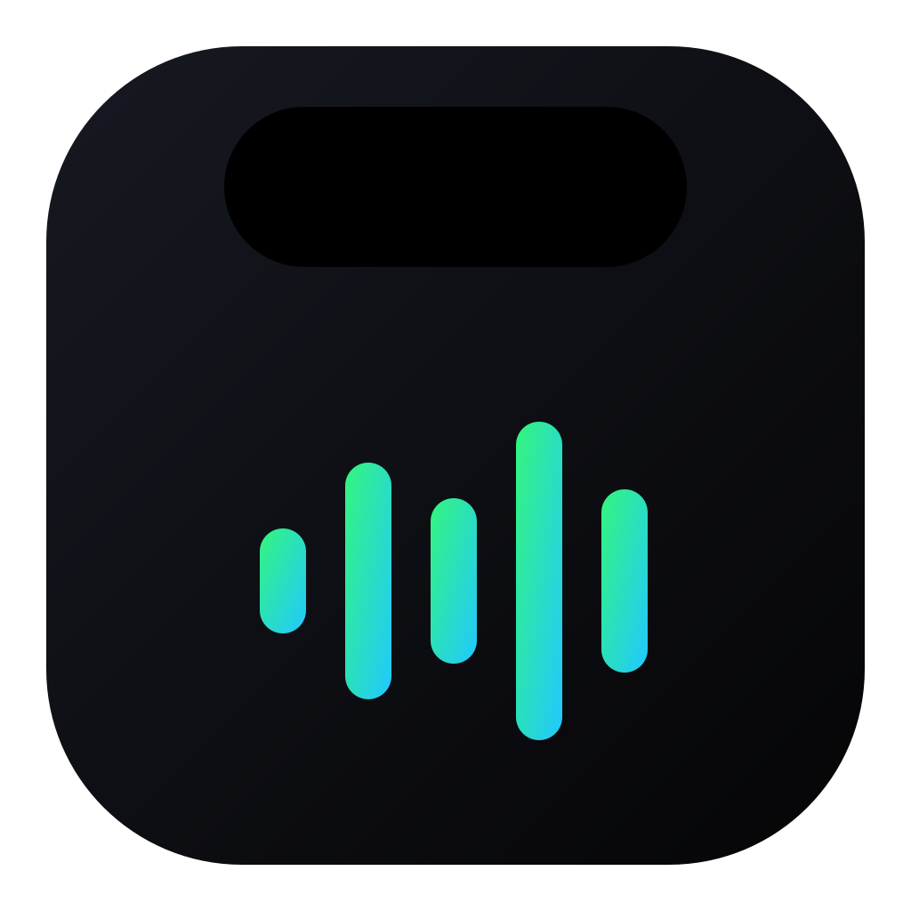
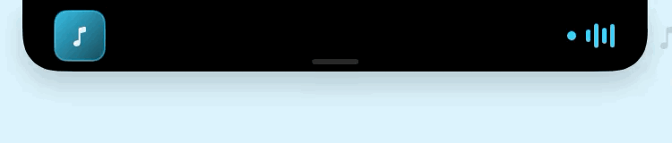
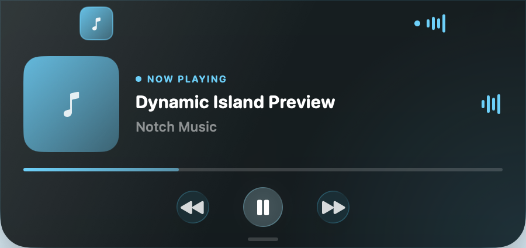

<p align="center">
  
</p>

<h1 align="center">Notch Music</h1>

<p align="center">
  MacBook 노치를 음악을 위한 작은 다이나믹 아일랜드로 바꿔보세요.
</p>

<p align="center">
  
  
  
  <a href="https://github.com/ghsgkq/notch-music/releases/latest"></a>
</p>

<p align="center">
  
</p>

## Notch Music이란?

Notch Music은 macOS에서 재생 중인 음악을 감지해 MacBook 노치 주변에 앨범 표지와 재생 상태를 보여주는 네이티브 메뉴 막대 앱입니다. 음악이 없을 때는 실제 노치와 하나처럼 숨어 있다가, 재생을 감지하면 양옆으로 부드럽게 펼쳐집니다.

노치를 클릭하면 곡 정보, 진행률, 이전·재생·다음 컨트롤이 포함된 플레이어가 나타납니다.

<p align="center">
  
</p>

## 주요 기능

| 기능 | 설명 |
| --- | --- |
| 다이나믹 컴팩트 UI | 음악이 없으면 노치 크기로 숨고, 음악 감지 시 앨범 아트와 이퀄라이저가 양옆으로 펼쳐집니다. |
| 미디어 컨트롤 | 이전 곡, 재생·일시정지, 다음 곡을 노치에서 바로 제어합니다. |
| 재생 위치 이동 | 진행률 바를 클릭하거나 드래그해 원하는 시간으로 이동합니다. |
| Liquid Glass | macOS 26에서는 펼친 플레이어에 네이티브 리퀴드 글래스 효과를 적용합니다. |
| 다양한 플레이어 | YouTube Music, Spotify, Apple Music 등 시스템 재생 정보를 제공하는 플레이어를 감지합니다. |
| 다중 모니터 | 외부 모니터가 주 화면이어도 내장 노치에 고정하거나, 외부 화면 전용 플로팅 UI를 사용할 수 있습니다. |
| 세밀한 설정 | 자동 펼침, 자동 접힘 시간, 표시 요소, 강조 색상, 애니메이션 및 화면 위치를 조절합니다. |
| 전체 화면 지원 | 모든 Space와 전체 화면 앱 위에서도 노치 UI를 유지합니다. |

## 다운로드 및 설치

### GitHub Releases에서 설치

1. [최신 Release](https://github.com/ghsgkq/notch-music/releases/latest)에서 `Notch-Music-v1.0.0.zip`을 다운로드합니다.
2. 압축을 풀고 `Notch Music.app`을 `응용 프로그램` 폴더로 옮깁니다.
3. 앱을 실행하면 Dock 대신 메뉴 막대에 음표 아이콘이 나타납니다.

개발자 서명이 없는 개인 빌드이므로 macOS가 첫 실행을 차단할 수 있습니다. 이 경우 앱을 우클릭해 `열기`를 선택하거나, `시스템 설정 → 개인정보 보호 및 보안 → 확인 없이 열기`를 사용하세요.

> 배포 ZIP은 Apple Silicon Mac용으로 빌드됩니다.

### 소스에서 빌드

필요 환경:

- macOS 14 이상
- Xcode 26 이상
- Swift 6

```bash
git clone https://github.com/ghsgkq/notch-music.git
cd notch-music
./Scripts/build-app.sh
open "dist/Notch Music.app"
```

완성된 앱은 `dist/Notch Music.app`에 생성됩니다.

## 사용 방법

1. YouTube Music, Spotify 또는 Apple Music에서 음악을 재생합니다.
2. 노치 양옆에 앨범 표지와 재생 애니메이션이 나타납니다.
3. 노치를 클릭해 상세 플레이어를 펼칩니다.
4. 컨트롤 버튼이나 진행률 바를 사용해 음악을 제어합니다.

라이브 방송처럼 전체 재생 시간이 없는 미디어에서는 진행률 이동 기능이 자동으로 비활성화됩니다.

## 설정

메뉴 막대의 음표 아이콘에서 `설정…`을 선택합니다. 변경 내용은 즉시 적용되며 앱을 다시 실행해도 유지됩니다.

| 설정 그룹 | 제공 옵션 |
| --- | --- |
| 곡 변경 | 새 곡의 상세 플레이어 자동 펼침, 자동 접기, 유지 시간 |
| 표시 | 노치 양옆 확장, 앨범 표지, 진행률, 이퀄라이저, 호버 효과 |
| 디스플레이 | 내장 디스플레이 고정 또는 현재 주 디스플레이 사용 |
| 스타일 | 펼친 화면 Liquid Glass, 강조 색상, 움직임 줄이기 |

내장 화면을 사용할 수 없는 클램셸 모드에서는 연결된 주 화면으로 자동 전환됩니다. 외부 화면에서는 물리 노치 대신 메뉴 막대 아래에 둥근 플로팅 플레이어가 표시됩니다.

## 프로젝트 구조

```text
notch-music/
├── Resources/                 # 앱 아이콘과 Info.plist
├── Scripts/                   # 앱 패키징 및 에셋 생성 도구
├── Sources/NotchMusic/
│   ├── NowPlayingController.swift
│   ├── NotchPanel.swift
│   ├── NotchView.swift
│   └── SettingsView.swift
└── Package.swift
```

## Release

최신 실행 파일과 변경 사항은 [GitHub Releases](https://github.com/ghsgkq/notch-music/releases)에서 확인할 수 있습니다.

현재 버전: **v1.0.0**
